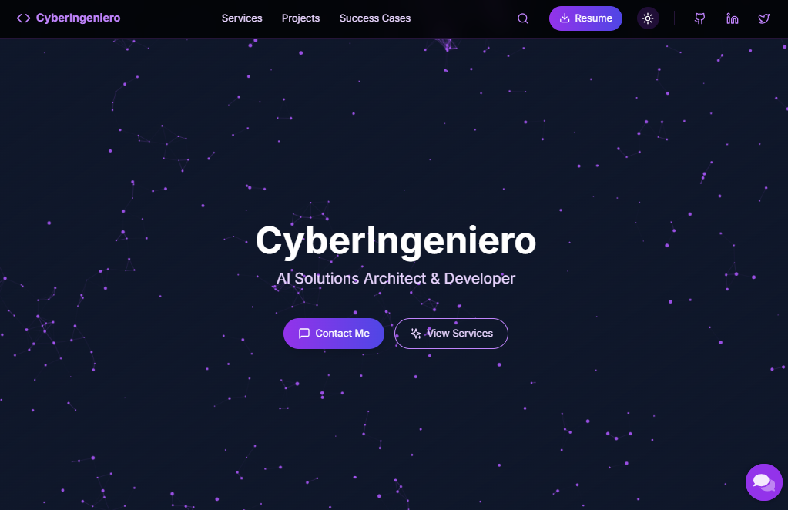
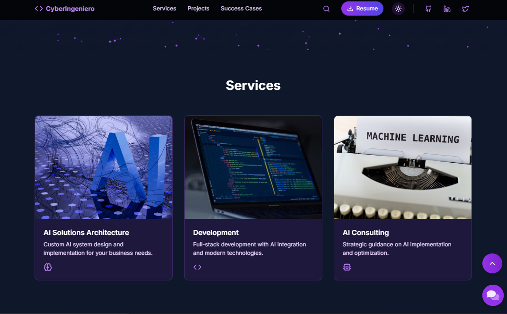
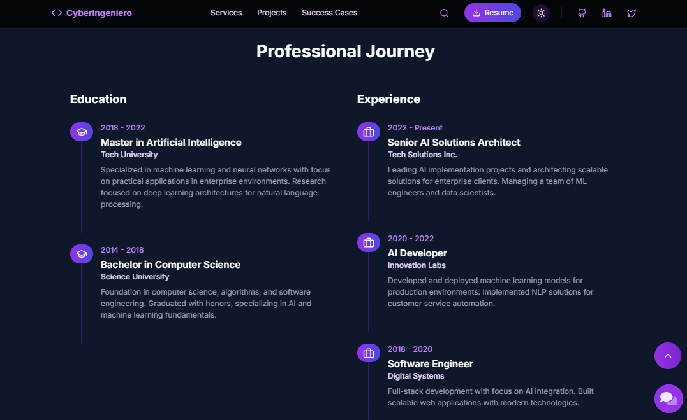
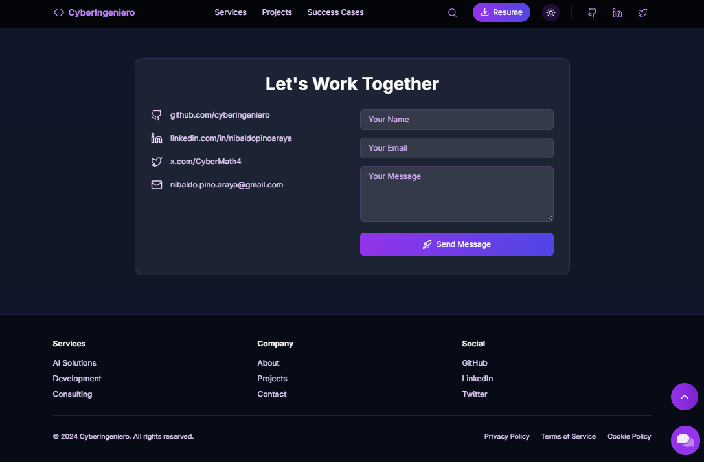

# Portfolio Website - CyberIngeniero

Welcome to the repository of Nibaldo's portfolio, a showcase of the work of an architect and AI solution developer. The portfolio highlights his experience, featured projects, and skills, along with a fully functional contact form that utilizes the Brevo API to send messages.

This project use Kubernetes and Docker to deploy the website to a Kubernetes cluster and GitHub Actions to build and deploy the Docker image as CI/CD pipeline.

## Features

- Personalized and responsive design
- Fully functional contact form powered by Brevo API
- Animated backgrounds and parallax scrolling
- Responsive navigation menu
- Customizable colors and fonts
- Support for dark mode

## Technologies Used

- Vite (Frontend development)
- React (Frontend library)
- TypeScript (JavaScript superset)
- Tailwind CSS (utility-first CSS framework)
- Brevo API (email delivery service)
- Kubernetes (container orchestration)
- Docker (containerization)

## Screenshots









## Getting Started

To get started with the project, follow these steps:

1. Clone the repository:

```bash
git clone https://github.com/cyberingeniero/PersonalPortfolio.git
```

2. Install the dependencies:

```bash
npm install
```

3. Start the development server:

```bash
npm run dev
```

4. Open your browser and navigate to `http://localhost:3000` to view the website.

## Customization

You can customize the website by modifying the following files:

- `src/config/site.ts`: Contains the site configuration, such as the name, title, description, GitHub username, contact information, social links, and resume URL.
- `src/config/content.ts`: Contains the content of the website, such as education, experience, and services.
- `src/config/contact.ts`: Contains the configuration for the contact form, including the API URL, API key, sender, and recipient information.
- `src/config/colors.ts`: Contains the custom colors for the website.
- `src/config/fonts.ts`: Contains the custom fonts for the website.

To customize the website, you can modify these files according to your preferences.

## Deployment

To deploy the website, you can use any static hosting service or a cloud-based platform. Here are some popular options:

- GitHub Pages: You can host the website on GitHub Pages by creating a new repository and adding the `index.html` file from the `dist` directory.
- Netlify: You can deploy the website to Netlify by following the instructions provided in the [Netlify documentation](https://docs.netlify.com/configure-builds/get-started/).
- Vercel: You can deploy the website to Vercel by following the instructions provided in the [Vercel documentation](https://vercel.com/docs/concepts/deployments/overview).

## Contributing

Contributions are welcome! If you have any suggestions or improvements, please feel free to submit a pull request or open an issue on the GitHub repository.

## License

This project is licensed under the MIT License. See the [LICENSE](LICENSE) file for more information.

## Built With

- [TypeScript](https://www.typescriptlang.org/): A typed superset of JavaScript that compiles to plain JavaScript.
- [Tailwind CSS](https://tailwindcss.com/): A utility-first CSS framework for rapidly building custom user interfaces.
- [Brevo](https://www.brevo.com/): An email marketing and transactional email service provider.
- [Framer Motion](https://www.framer.com/motion/): A production-ready motion library for React that allows you to animate components with ease.
- [React Icons](https://react-icons.github.io/react-icons/): A library of popular icons for React applications.
- [React Email](https://react.email/): A framework for building responsive and accessible email templates using React components.
- [React Hook Form](https://react-hook-form.com/): A library for building forms in React with ease and flexibility.
- [React Toastify](https://fkhadra.github.io/react-toastify/): A library for displaying toast notifications in React applications.
- [React Typed](https://github.com/ssbeefeater/react-typed): A library for creating typing animations in React applications.
- [React Vertical Timeline Component](https://stephane-monnot.github.io/react-vertical-timeline-component/): A library for creating vertical timelines in React applications.
